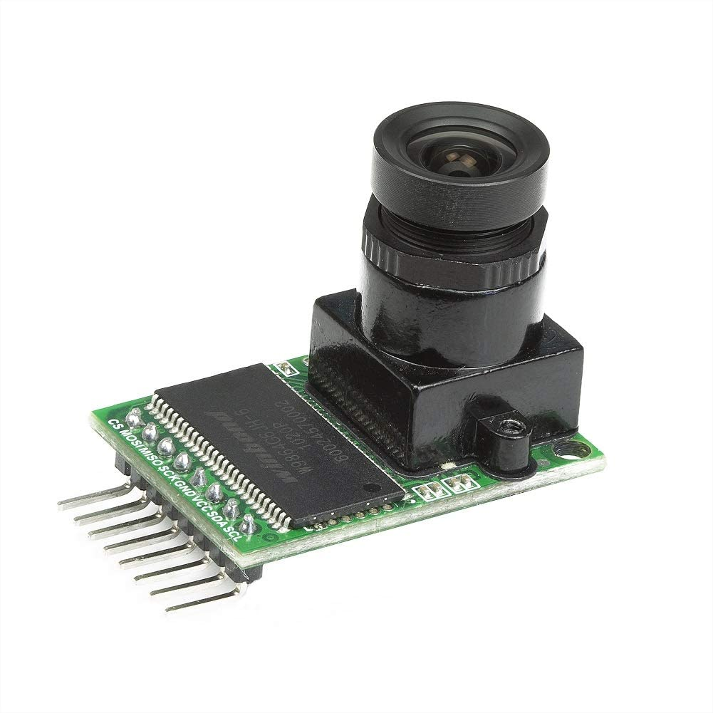

# Smart-Doorbell

A smart doorbell developed in C++ with notifications and a live video stream

## Hardware

### SoC
Supports SoCs with integrated networking and the ability to run some form of embedded Linux (Rasperry Pi, etc.)
### Camera
This repository supports the [Arducam 5MP OV5642](https://www.amazon.com/Arducam-Module-Camera-Arduino-Mega2560/dp/B013JUKZ48/ref=sr_1_4?dchild=1&keywords=arducam+5mp&qid=1610152383&sr=8-4) camera module for getting a live video feed

